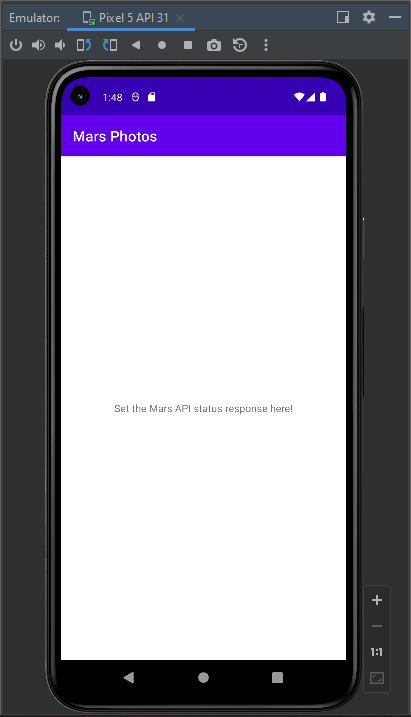
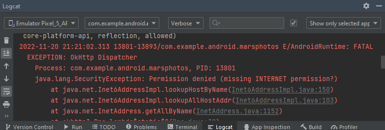
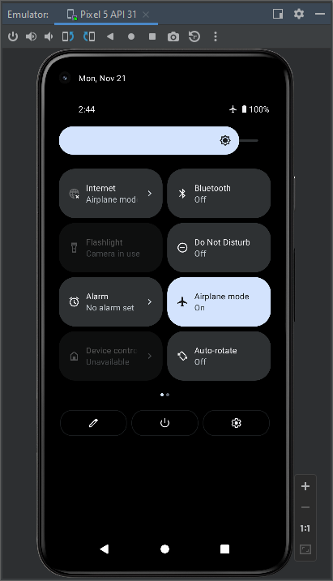
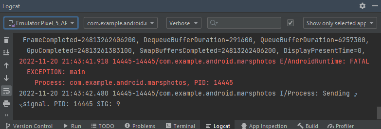
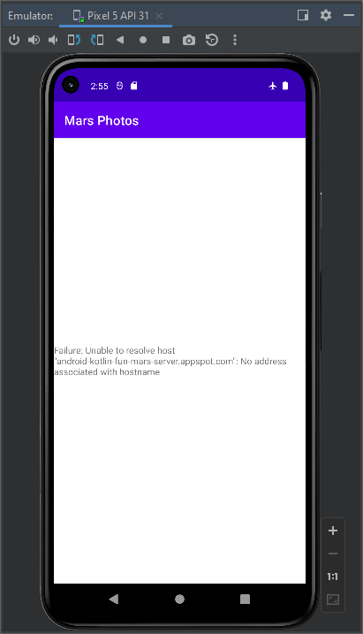
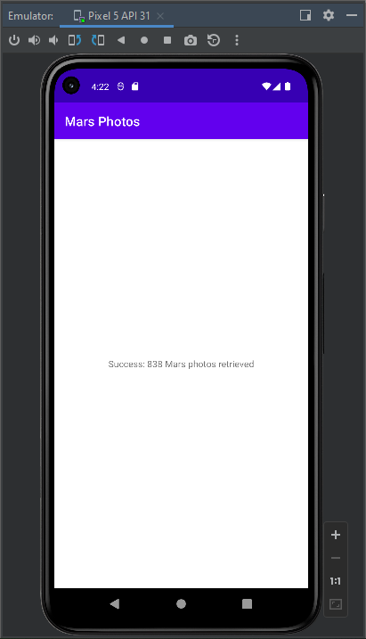

# Laboratorio 10 (Parte 1): Como obtener datos de internet

## Inovación y Emprendimiento con Tecnologías de Información

#### Camilo Andrés Pichimata Cárdenas

##### Noviembre del 2022

## Acerca de este codelab

### Escrito por El equipo de capacitación de Google Developers

##### https://developer.android.com/codelabs/basic-android-kotlin-training-getting-data-internet#0

## Antes de comenzar

En este codelab, usarás bibliotecas desarrolladas de código abierto para compilar la capa de red y obtener datos de un servidor backend.

### Conocimientos que ya deberías tener

- Cómo crear y usar fragmentos

- Cómo usar los componentes de la arquitectura de Android ViewModel y LiveData

- Cómo agregar dependencias en un archivo de Gradle

### Qué aprenderás

- Qué es un servicio web REST

- Cómo usar la biblioteca Retrofit para conectarte a un servicio web REST en Internet y obtener una respuesta

- Cómo usar la biblioteca Moshi para analizar la respuesta JSON en un objeto de datos

### Actividades

- Modificarás una app de inicio para realizar una solicitud a la API de servicio web y manejar la respuesta.

- Implementarás una capa de red para tu app usando la biblioteca Retrofit.

- Analizarás la respuesta JSON del servicio web en los objetos LiveData de tu app con la biblioteca Moshi.

- Usarás la compatibilidad de Retrofit para las corrutinas a fin de simplificar el código.

### Requisitos

- Una computadora que tenga Android Studio instalado

- Código inicial para la app de MarsPhotos

## Descripción General de la app

En esta ruta de aprendizaje, trabajarás con una app de inicio llamada MarsPhotos, que muestra imágenes de la superficie de Marte. Esta app se conecta a un servicio web para recuperar y mostrar las fotos de Marte. Las imágenes son fotografías reales de Marte capturadas por los Mars rovers de la NASA.

La versión de la app que compilas en este codelab no tendrá muchos elementos visuales llamativos, ya que se centra en la parte de la capa de red de la app para conectarse a Internet y descargar los datos de propiedad sin procesar con un servicio web. Para garantizar que los datos se recuperen y analicen correctamente, solo mostrarás el número de fotos recibidas del servidor backend en una vista de texto como se puede apreciar a continuación:


## Explora la app de inicio de MarsPhotos

Descargamos el código de inicio accediendo a la siguiente URL:

https://github.com/google-developer-training/android-basics-kotlin-mars-photos-app/tree/starter

Abrimos la aplicación Android Studio, ejecutamos el emulador y ejecutamos la aplicación para ver que funciona correctamente:



## Servicios web y Retrofit

### Cómo agregar dependencias de Retrofit

Para agregar las dependencias necesarias para el uso de la biblioteca Retrofit se realizó lo siguiente:

- Se verifica que existan los repositorios `google()` y `jcenter` en el archivo de nivel superior `build.gradle(Project: MarsPhotos)`

```
    repositories {
        google()
        mavenCentral()
    }
```

- Se agregan en el archivo Gradle de nivel de módulo, `build.gradle (Module: MarsPhots.app)` en la sección `dependencies` las siguientes líneas para las bibliotecas Retrofit:

```
// Retrofit
implementation "com.squareup.retrofit2:retrofit:2.9.0"
// Retrofit with Moshi Converter
implementation "com.squareup.retrofit2:converter-scalars:2.9.0"
```

La primera dependencia es para la biblioteca Retrofit2 y la segunda es para el conversor escalar de Retrofit. Este conversor permite que Retrofit muestre el resultado JSON como _String_. Las dos bibliotecas funcionan juntas.

- Hacemos click en **_Sync Now_** para compilar el proyecto con las dependencias nuevas.

### Cómo agregar compatibilidad con funciones del lenguaje Java 8

Muchas bibliotecas de terceros, como Retrofit2, usan funciones del lenguaje Java 8. El complemento de Android para Gradle tiene compatibilidad integrada para usar determinadas funciones del lenguaje Java 8. Para verificar que esta configuración se ha aplicado nos aseguramos que el siguiente código esté presente en el archivo `build.gradle(Module: MarsPhotos.app)`:

```
android {
  ...

  compileOptions {
    sourceCompatibility JavaVersion.VERSION_1_8
    targetCompatibility JavaVersion.VERSION_1_8
  }

  kotlinOptions {
    jvmTarget = '1.8'
  }
}
```

## Conectando a Internet, permisos y manejo de excepciones

Para poder conectarnos a internet debemos agregar una capa de red al proyecto MarsPhotos que el ViewModel usará para comunicarse con el servicio web. Se implementará la API del servicio de Retrofit con los siguientes pasos:

- Crea una capa de red: la clase MarsApiService.
- Crea un objeto de Retrofit con la URL de base y la fábrica del conversor.
- Crear una interfaz que explique cómo habla Retrofit con nuestro servidor web.
- Crea un servicio de Retrofit y expón la instancia del servicio de la API al resto de la app.

Para esto creamos un nuevo _Package_ dentro de **com.example.android.marsphotos** llamado **_network_** y dentro de este creamos un nuevo archivo **MarsApiService.kt** con el siguiente contenido:

```kotlin
package com.example.android.marsphotos.network

import retrofit2.Retrofit
import retrofit2.converter.scalars.ScalarsConverterFactory
import retrofit2.http.GET

private const val BASE_URL = "https://android-kotlin-fun-mars-server.appspot.com"
private val retrofit = Retrofit.Builder()
    .addConverterFactory(ScalarsConverterFactory.create())
    .baseUrl(BASE_URL)
    .build()

interface MarsApiService {
    @GET("photos")
    suspend fun getPhotos() : String
}

object MarsApi {
    val retrofitService : MarsApiService by lazy {
        retrofit.create(MarsApiService::class.java) }
}
```

Seguido a esto vamos al archivo `overview/OverviewViewModel` y modificamos el método `getMarsPhotos()` de la siguiente manera:

```kotlin
private fun getMarsPhotos() {
    viewModelScope.launch {
        val listResult = MarsApi.retrofitService.getPhotos()
        _status.value = listResult
    }
}
```

Podemos ver que la aplicación se compila de manera exitosa pero se abre y se cierra al momento de ejecutarse en el emulador; si vamos a la pestaña `Logcat` de la barra inferior en Android Studio podemos ver lo siguiente:



Esto se debe a que por razones de seguridad en Android las aplicaciones deben solicitar permisos, entre estos el de acceso a internet; para dar solución a esto debemos acceder al archivo `manifests/AndroidManifest.xml` y agregamos la siguiente línea justo antes de la etiqueta `<application>`:

```xml
<uses-permission android:name="android.permission.INTERNET" />
```

Ejecutamos de nuevo la aplicación y podemos ver que se ejecuta correctamente:


Ahora vamos a simular que se presenta un error de conexión de red, para esto cerramos la app y activamos el modo avion en el emulador:



Si ejecutamos nuevamente la aplicación esta se abrirá y se volverá a cerrar, esto se debe nuevamente a una excepción, la cuál se muestra a continuación, nuevamente desde la pestaña `Logcat`:



Esto se debe a que no se ha aplicado el _manejo de excepciones_, esto con el fin de impedir que la app se cierre de manera repentina. Para dar solución a esto vamos al archivo `overview/OverviewViewModel.kt` y modificamos el código del método `getMarsPhotos()` de la siguiente manera:

```
private fun getMarsPhotos() {
    viewModelScope.launch {
        try {
            val listResult = MarsApi.retrofitService.getPhotos()
            _status.value = listResult
        } catch (e: Exception) {
            _status.value = "Failure: ${e.message}"
        }
    }
}
```

De esta forma al ejecutarse la aplicación nuevamente con el modo avion activado, se le mostrará al usuario la excepción como texto y no se cerrará la aplicación repentinamente:



Como se puede ver en este caso la app muestra onformación sobre el fallo que se presentó debido a la inexistencia de la conexión a internet. Al desactivar el modo avión y volver a abrir la aplicación, está funciona correctamente y se puede ver la información en formato JSON de las imágenes como se presentó anteriormente.

## Analiza la respuesta JSON con Moshi

Ahora vamos a analizar la cadena de objetos JSON para convertirlos a objetos Kotlin mediante una biblioteca externa llamada Moshi. Se cambiará la app de modo que en lugar de mostrar el JSON sin procesar, muestre la cantidad de fotos de Marte que se muestran.

### Dependencias de la biblioteca Moshi

- Abrimos el archivo `build.gradle (Module: app)` y agregamos la siguiente dependencia:

```
// Moshi
implementation 'com.squareup.moshi:moshi-kotlin:1.9.3'
```

- Buscamos las siguientes líneas, del conversor de escalar Retrofit insertadas anteriormente:

```
// Retrofit
implementation "com.squareup.retrofit2:retrofit:2.9.0"
// Retrofit with Moshi Converter
implementation "com.squareup.retrofit2:converter-scalars:2.9.0"
```

Y las reemplazamos por:

```
// Retrofit with Moshi Converter
implementation 'com.squareup.retrofit2:converter-moshi:2.9.0'
```

### Implementación la clase de datos de Mars Photos

Para realizar las implementaciones necesarias creamos un archivo llamado `MarsPhoto.kt` demtro del paquete `network` con el siguiente contenido:

```Kotlin
package com.example.android.marsphotos.network

import com.squareup.moshi.Json

data class MarsPhoto (
    val id: String, @Json(name = "img_src") val imgSrcUrl: String
)
```

Esto le permitirá crear objetos Kotlin a partir de las cadenas en formato JSON

### Actualización de MarsApiService y OverviewViewModel

Para realizar a la librería Moshi, realizamos los siguientes cambios:

- Modificamos el archivo `network/MarsApiService.kt` de la siguiente manera:

```kotlin
package com.example.android.marsphotos.network

import com.squareup.moshi.Moshi
import com.squareup.moshi.kotlin.reflect.KotlinJsonAdapterFactory
import retrofit2.Retrofit
import retrofit2.converter.moshi.MoshiConverterFactory
import retrofit2.http.GET

private const val BASE_URL = "https://android-kotlin-fun-mars-server.appspot.com"

private val moshi = Moshi.Builder()
    .add(KotlinJsonAdapterFactory())
    .build()

private val retrofit = Retrofit.Builder()
    .addConverterFactory(MoshiConverterFactory.create(moshi))
    .baseUrl(BASE_URL)
    .build()

interface MarsApiService {
    @GET("photos")
    suspend fun getPhotos(): List<MarsPhoto>
}

object MarsApi {
    val retrofitService : MarsApiService by lazy {
        retrofit.create(MarsApiService::class.java) }
}
```

- Luego modificamos en el método `getMarsPhotos()` del archivo `overview/OverviewViewModel.kt` el valor de la variable `_status` de la siguiente manera:

```kotlin
private fun getMarsPhotos() {
        viewModelScope.launch {
            try {
                val listResult = MarsApi.retrofitService.getPhotos()
                _status.value = "Success: ${listResult.size} Mars photos retrieved"  // Linea modificada
            } catch (e: Exception) {
                _status.value = "Failure: ${e.message}"
            }
        }
    }
```

Realizados todos estos cambios se procede a ejecutar la aplicación donde podemos ver lo siguiente:



Como se puede ver ahora la aplicación funciona correctamente y presenta el número total de fotos existentes en el servidor.
